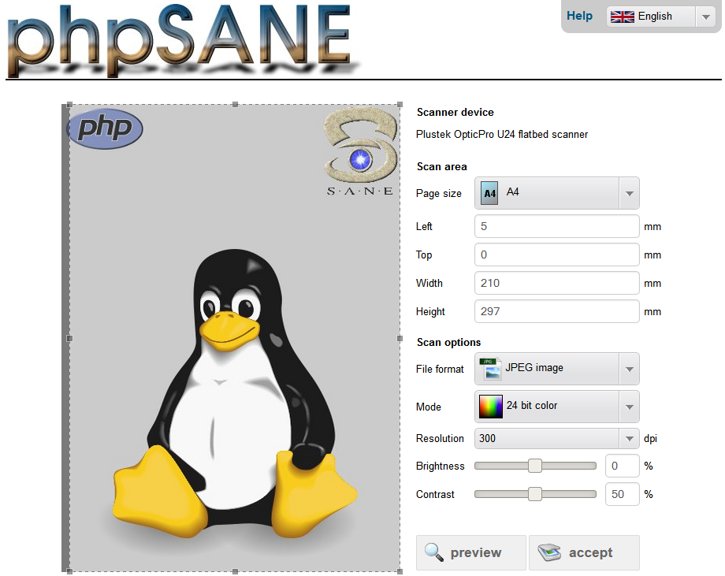
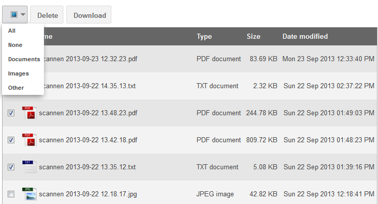

# 
phpSANE is a web-based frontend for SANE written in HTML/PHP so you can scan with
your web-browser. It also supports OCR.

<details>
  <summary>Screenshots</summary>

   <p />
   <p />
</details>
<p />

This project was originally written by "dfroe" and hosted on SourceForge at
https://sourceforge.net/projects/phpsane/

The original project appears to be defunct (no commits since 2013, no ability to
raise tickets), and some changes were necessary to make it work correctly with
current versions of SANE, thus I forked it to GitHub.

Installation is simple: copy the entire directory hierarchy below webroot/ to the
desired web root.  The service account for the HTTP daemon needs to be a member
of whatever group owns scanners (typically "scanner").

01 June 2019 Christopher Kobayashi <software+github@disavowed.jp>

Original README (English version) follows:
<details>

     phpSANE   (Version 0.6.0)
    ~~~~~~~~~

  phpSANE is a web-based frontend for SANE written in PHP.
  Now you can scan with your web-browser, too.

  Copyright (C) 2009  David Froehlich <dfroe@gmx.de>
                      and John Walsh <john.walsh@mini-net.co.uk>
                      and Wojciech Bronisz <wojtek@bronisz.eu>

  This program is free software; you can redistribute it and/or modify it under
  the terms of the GNU General Public License as published by the Free Software
  Foundation; either version 2 of the License, or (at your option) any later
  version.
  This program is distributed in the hope that it will be useful, but
  WITHOUT ANY WARRANTY; without even the implied warranty of MERCHANTABILITY or
  FITNESS FOR A PARTICULAR PURPOSE. See the GNU General Public License for more
  details.
  You should have received a copy of the GNU General Public License along
  with this program; if not, write to the Free Software Foundation, Inc., 59
  Temple Place, Suite 330, Boston, MA 02111-1307, USA.


  ------------------------------------------------------------------------

  Requirements:
  ^^^^^^^^^^^^^
  * SANE
  * netpbm
  * Apache web-server with PHP-support
  * gocr (optional)


  ------------------------------------------------------------------------

  Installation:
  ^^^^^^^^^^^^^
  Just copy the phpSANE-directory into your www-root.
  Then you can scan by opening phpsane.php in your web-browser.


  ------------------------------------------------------------------------

  FAQ:
  ^^^^

  Q: How do I check if my scanner is working ?

  A: Before trying phpSANE, it is a good idea to make sure that your
  scanner is detected and working from the local machine. To do this,
  just use one of the scanner applications :-

  Application Menu->Graphics->Scanner Tool
  Application Menu->Graphics->The GIMP, File->Aquire->XSane: Device Dialog...

  If your scanner does not work directly from your machine, then it will
  not work through phpSANE.

  ----------

  Q: My scanner isn't found by phpSANE ?
  Q: My scanner is detected, but when I preview or scan, the image file
  is empty ?

  A: this is probably a permissions problem, try :-

  chmod +s /usr/bin/scanimage
  chmod 775 WWW_PHPSANE_DIR/tmp

  WWW_PHPSANE_DIR = the www file area you put phpSANE at.

  ie. Make sure that your apache user is able to scan with scanimage,
  and your apache user must have write-access to the phpSANE tmp directory.

  ----------

  Q: phpSANE is showing my scanner by a different name/model ?

  A: In different regions of the world, a scanner may be sold by different
  model names and numbers, but the internal hardware is exactly the same.
  So it may be that to the SANE project, the scanner is recognised by a
  different name to the one that you know your scanner as. For example,
  the Epson Perfection range of scanners are sold in Japan under the
  model names GT-****.

  ----------

  Q: phpSANE is working, but when I 'Scan', nothing happens ?

  A: There could be two things wrong :-

  a) the 'Scan Area' could be invalid,
  ie. you have not selected an area to scan.

  b) when a scan completes, a new window is opened with the scan
  results to allow you to save it - this may be blocked by a
  'pop-up' blocker.

  ----------

  Q: phpSANE is working fine, but how do I restrict access to it to my
  internal network only ?
  A: in httpd.conf :-

  <Directory "WWW_PHPSANE_DIR/">
      DirectoryIndex phpsane.php
      Order Deny,Allow
      Deny from all
      Allow from 127.0.0.0/8
      Allow from 192.168.1.0/24
  </Directory>

  ------------------------------------------------------------------------

</details>

## Installation on (Debian/Ubuntu) Linux
* download code
```
$ git clone https://github.com/christopherkobayashi/phpSANE.git
```

* install pre-requisites
```
sudo apt install php apache2 libapache2-mod-php sane sane-utils libsane-extras poppler-utils imagemagick -y
```

* find scanner in (`dmesg`) boot log
```
$ dmesg
...
[    1.993595] usb 1-1.2: New USB device found, idVendor=0461, idProduct=038b
[    1.993601] usb 1-1.2: New USB device strings: Mfr=1, Product=2, SerialNumber=0
[    1.993605] usb 1-1.2: Product: USB Scanner
[    1.993608] usb 1-1.2: Manufacturer: Primax
...
```

  Take note of:
    * idVendor=0461
    * idProduct=038b

* find scanner in list of usb devices
```
$ lsusb
Bus 001 Device 006: ID 148f:7601 Ralink Technology, Corp. MT7601U Wireless Adapter
Bus 001 Device 004: ID 0461:038b Primax Electronics, Ltd Xerox 2400 Onetouch
Bus 001 Device 003: ID 0424:ec00 Standard Microsystems Corp. SMSC9512/9514 Fast Ethernet Adapter
Bus 001 Device 002: ID 0424:9512 Standard Microsystems Corp. SMC9512/9514 USB Hub
Bus 001 Device 001: ID 1d6b:0002 Linux Foundation 2.0 root hub
```

  Take note of:
    * idVendor=0461
    * idProduct=038b

* setup `udev` rule for scanner
```
$ sudo nano /etc/udev/rules.d/55-libsane.rules
```
  Add following:
  ```
  # from dmesg or list of usb devices
  # Primax Electronics, Ltd Xerox 2400 Onetouch
  ATTRS{idVendor}=="0461", ATTRS{idProduct}=="038b", MODE="0666", GROUP="scanner", ENV{libsane_matched}="yes"
  ```
  Note _idVendor_ and _idProduct_ are from `dmesg` log or list of usb devices

* add _Apache2_ user to _scanner_ group
```
$ sudo adduser www-data scanner
```

* add yourself to scanner group
```
$ sudo adduser <your-user-name> scanner
```

* reboot so device is created by `udev` with correct group
* login so group membership takes effect

* check scanner is detected
```
$ scanimage -L
device `genesys:libusb:001:004' is a Xerox OneTouch 2400 flatbed scanner
```

  Take note of:
    * scanner backend=_genesys_

* add entry in _sane_ (_genesys_) backend
```
$ sudo nano /etc/sane.d/genesys.conf
```
  Format is:

    `usb <idVendor> <idProduct>`

  Add the following lines:
  ```
  # Primax Electronics, Ltd Xerox 2400 Onetouch
  usb 0x0461 0x038b
  ```
  Note that entries have initial **0x**

* copy files
```
$ sudo cp ~/phpSANE/webroot /var/www/html
```

* [optional] edit apache2 config file ([Note: Ubuntu/Debian doesn't use `httpd.conf` as standard](https://askubuntu.com/questions/652095/cant-find-httpd-conf))
```
$ sudo nano /etc/apache2/apache2.conf
```

* add _Apache_ user to _scanner_ group
```
$sudo adduser www-data scanner
```

* let _Apache_ user write files
```
$sudo chmod 775 /var/www/html/tmp
$sudo chmod 775 /var/www/html/output
```

* restart webserver
```
$ sudo systemctl restart apache2
```

* browse to _phpSANE_ web page

  http://[your-server-ip]

## Quick troubleshooting checklist
Based on information [here](https://help.ubuntu.com/community/sane_Troubleshooting)

* list all usb devices
```
$ lsusb
```

* return all attached scanners, supported or not
```
$ sane-find-scanner
```

* return attached supported scanners
```
$ scanimage -L
```

* same as above, with a lot more detail, including telling you what backends are and are not loaded
```
$ SANE_DEBUG_DLL=5 scanimage -L
```

* same as above, with root privileges
```
$ sudo scanimage -L
```

* run a test of the scanner
```
$ scanimage -T
```

* return version of sane-backends
```
$ scanimage -V
```

* scan an image
```
$ scanimage > test.pnm
$ scanimage --format=tiff > test.tiff
$ scanimage --format=jpeg > test.jpg
$ scanimage --format=png > test.png
$ scanimage --mode Color --resolution 300 --format=jpeg > test001.jpg
```

## Advanced troubleshooting
<details>
  <summary>Scanner setup</summary>

  Based on information from:
  * http://www.openfusion.net/linux/scansnap_1300i
  * http://fbcorner.tuxfamily.org/linux.html
  * https://askubuntu.com/questions/192134/iscan-only-runs-as-root
  * https://www.johndstech.com/how-to/geek-friday-setting-up-epson-scanning-on-raspberry-pi/

</details>

* What does webserver see?

    http://[your-server-ip]/diag.php


  This is the output of:
  ```
  scanimage -L
  ```

* Check device ownership
  ```
  $ sudo scanimage -L
  device `genesys:libusb:001:004' is a Xerox OneTouch 2400 flatbed scanner

  # note udev path

  $ sudo ls -al /dev/bus/usb/001/004
  crw-rw-rw- 1 root scanner 189, 3 Aug 23 17:38 /dev/bus/usb/001/004

  # device should be owned by 'scanner' group
  ```

* Check group membership
  ```
  # you
  $ groups
  <your-user-name> sudo audio scanner saned

  # Apache user
  $ groups www-data
  www-data : www-data scanner saned

  # should be member of 'scanner' group
  ```

* Apache logs
  ```
  $ sudo cat /var/log/apache2/error.log
  ```

## Useful links
* https://help.ubuntu.com/community/sane
* https://help.ubuntu.com/community/Scanners
* https://help.ubuntu.com/community/ScanningHowTo
* https://help.ubuntu.com/community/sane_Troubleshooting
* https://help.ubuntu.com/community/SettingScannerPermissions
* http://www.zz9.co.za/howto-scanners-on-linuxraspberry-pi-project-sane/
